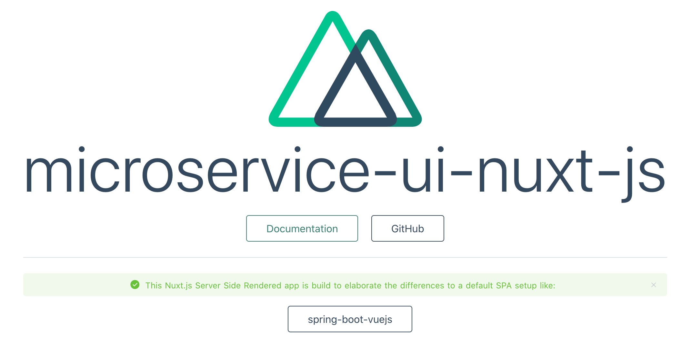
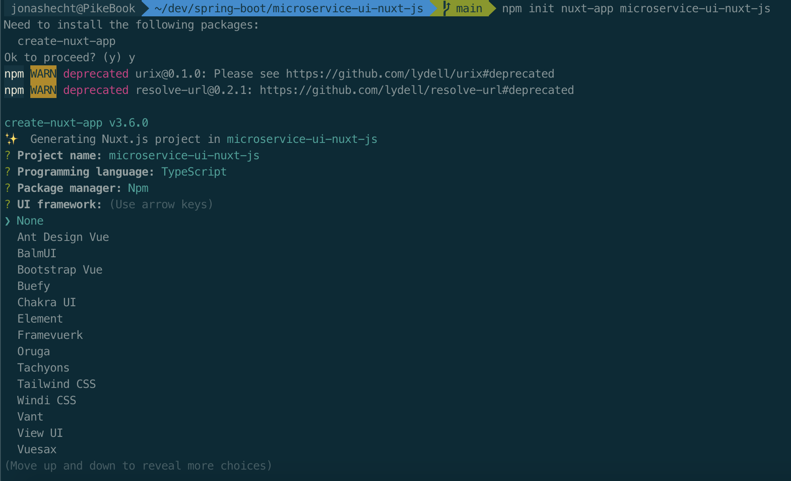
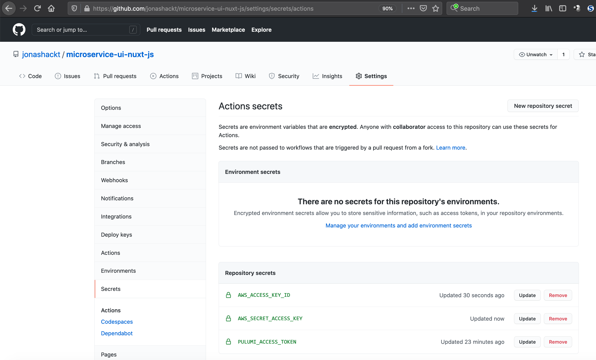
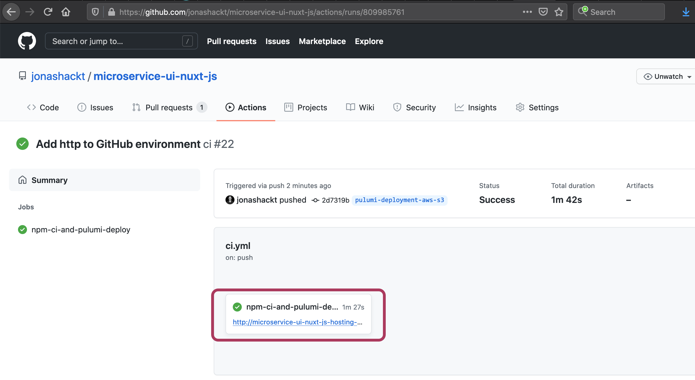

# microservice-ui-nuxt-js
[](https://github.com/jonashackt/microservice-ui-nuxt-js/actions)
[](https://github.com/jonashackt/spring-boot-vuejs/blob/master/LICENSE)
[](https://renovatebot.com)
[](https://nuxtjs.org/)

Example project showing how to create &amp; deploy a Nuxt.js / Vue.js based frontend and how to interact with a Spring Boot microservice (https://github.com/jonashackt/microservice-api-spring-boot)



> The purpose of this project is elaborate the differences of a Nuxt.js / SSR or Static Site Generation based project to https://github.com/jonashackt/spring-boot-vuejs
```shell
┌────────────────────────────────┐
│                                │
│                                │
│    microservice-ui-nuxt-js     │
│                                │
│                                │
└───────────────┬────────────────┘
                │
                │
┌───────────────▼────────────────┐
│                                │
│                                │
│  microservice-api-spring-boot  │
│                                │
│                                │
└────────────────────────────────┘
```

## Universal Web Apps?

https://m.heise.de/developer/artikel/Interaktive-Websites-mit-Nuxt-js-fuer-Geschwindigkeit-SEO-und-Social-Media-4516901.html?seite=all

"Universal Webapps" --> faster loading of web sites!

> How? server does pre-rendering of the "start" HTML & CSS on server-side - and then loads JavaScript & dynamic CSS in the background, but user can already scroll and read.

All 3 popular web frameworks support Universal Web Apps:

* Angular: https://angular.io/guide/universal
* React: https://nextjs.org/ and https://www.gatsbyjs.com/
* Vue.js: https://nuxtjs.org/


## Nuxt.js

For all concepts see https://nuxtjs.org/docs/2.x/concepts/views

There are 3 modes: normal SPA (like Vue), Server Side Rendering (SSR) & Static Side Generation

* __SPA__: In this mode, Nuxt.js behaves just like a normal Vue.js application
* __[Server Side Rendering (SSR)](https://nuxtjs.org/docs/2.x/concepts/server-side-rendering)__: SSR sends fully rendered page from server to the client -> which then gets hydrated (https://ssr.vuejs.org/guide/hydration.html), which means that Vue.js turns the server rendered page into dynamic DOM that can react to client-side data changes
* __[Static Site Generation](https://nuxtjs.org/docs/2.x/concepts/static-site-generation)__: the application gets rendered during build phase and can then be deployed to any static hosting service (Netlify, GitHub Pages, AWS S3 static site hosting, Static hosting on Azure Storage Accounts etc.). There's no server needed for deployment & the content is delivered via Content Delivery Networks (CDNs). Additionally in Static Side Generation mode there's also [a SPA Fallback for sites that should be rendered on client side and won't be served through the CDN](https://nuxtjs.org/docs/2.x/concepts/static-site-generation#spa-fallback).


## Getting Started

See https://nuxtjs.org/docs/2.x/get-started/installation

```shell
npm init nuxt-app microservice-ui-nuxt-js
```

Now we need to choose something - I opted for TypeScript (is already used in https://github.com/jonashackt/spring-boot-vuejs with Vue.js 3.x).

Then a huge list of UI frameworks pops up:



There are lot's of options, be it:

* Element https://element-plus.org/#/en-US
* Framevuerk https://framevuerk.com/
* Chakra UI https://github.com/chakra-ui/chakra-ui/ (which seems to be more on the React side of things)
* Bootstrap Vue (which prevents us from using Vue.js 3.x/next (see https://github.com/jonashackt/spring-boot-vuejs#bootstrap-support-for-vuejs-3next))

I went with Element, since it seemed to be widely used (nearly 10k GH stars) and is build with TypeScript + Vue.js 3.x (incl. Composition API) support.

Additionally I chose Axios as HTTP framework, Jest for unit testing and finally chose:

```shell
? Rendering mode:
Universal (SSR / SSG)
```

over the `Single Page App` possibility (since we want to be able to grasp the differences to a standard SPA with Vue).

Also I chose the`Deployment target` to be `Static (Static/Jamstack hosting)` (we'll have a look onto the `Server (Node.js hosting)` later).

Impressively Nuxt.js also asks which Development (dependabot, jsconfig, Semantic Pull Requests) or CI/CD tools you want to use.

This is my full configuration:

```shell
create-nuxt-app v3.6.0
✨  Generating Nuxt.js project in microservice-ui-nuxt-js
? Project name: microservice-ui-nuxt-js
? Programming language: TypeScript
? Package manager: Npm
? UI framework: Element
? Nuxt.js modules: (Press <space> to select, <a> to toggle all, <i> to invert selection)
? Linting tools: (Press <space> to select, <a> to toggle all, <i> to invert selection)
? Testing framework: Jest
? Rendering mode: Universal (SSR / SSG)
? Deployment target: Static (Static/Jamstack hosting)
? Development tools: (Press <space> to select, <a> to toggle all, <i> to invert selection)
? Continuous integration: GitHub Actions (GitHub only)
? What is your GitHub username? jonashackt
? Version control system: Git
```

After project generation has finished, let's finally run our project skelleton with:

```shell
npm run dev
```

## Vue.js 3.x with Nuxt.js & TypeScript

https://dev.to/iamschulz/scaffolding-an-app-with-vue-3-nuxt-and-typescript-51hl

> At the time of writing, Nuxt (2.15) still uses Vue 2 by default, but it provides a node package that exposes the Composition API

We need to add `@nuxtjs/composition-api` ourselves:

```shell
npm install @nuxtjs/composition-api
```

This will enable kind of an beta support for Vue.js 3.x - see https://composition-api.nuxtjs.org/ 

It can be removed with the release of Nuxt 3.x.

For the full setup docs, see https://composition-api.nuxtjs.org/getting-started/setup

We also need to add it as `buildModules` to our [nuxt.config.js](nuxt.config.js):

```javascript
  // Modules for dev and build (recommended): https://go.nuxtjs.dev/config-modules
  buildModules: [
    ...
    '@nuxtjs/composition-api/module'
  ],
```

[Current static-site generation issue](Currently there's an issue with static site generation and async functions which means that you'll need to add time between pages being generated to allow for any async functions to resolve, if you are pre-generating any of your pages):

> Currently there's an issue with static site generation and async functions which means that you'll need to add time between pages being generated to allow for any async functions to resolve, if you are pre-generating any of your pages

So let's add the `generate` configuration to our [nuxt.config.js](nuxt.config.js) also:

```javascript
  // see https://composition-api.nuxtjs.org/getting-started/setup &
  // https://github.com/nuxt-community/composition-api/issues/44
  generate: {
    // choose to suit your project
    interval: 2000,
  }
```

Now everything is setup to go. We can now use the Vue 3.x style component defintion in our Pages/Views like this in the `script` section:

```javascript
<script lang="ts">
import { defineComponent } from "@nuxtjs/composition-api";
```


## Multiple Nuxt Pages: Routing & Navigation

Here we go: https://nuxtjs.org/docs/2.x/get-started/routing

#### Automatic Routes

> Most websites will have more than one page (i.e. a home page, about page, contact page etc.). In order to show these pages, we need a Router. That's where vue-router comes in. When working with the Vue application, you have to set up a configuration file (i.e. router.js) and add all your routes manually to it. Nuxt.js automatically generates the vue-router configuration for you, based on your provided Vue files inside the pages directory. That means you never have to write a router config again! Nuxt.js also gives you automatic code-splitting for all your routes.

> In other words, all you have to do to have routing in your application is to create .vue files in the pages folder.

Pretty cool :) Simply put your `.vue` files into `/pages` dir.


#### Navigation & where's my App.vue gone aka Layouts

https://nuxtjs.org/docs/2.x/get-started/routing#navigation

> To navigate between pages of your app, you should use the NuxtLink component. This component is included with Nuxt.js and therefore you don't have to import it as you do with other components

So if you come from Vue.js development like me, you may like the following mapping:

* `<router-link` in Nuxt is `<NuxtLink>` (see https://nuxtjs.org/docs/2.x/get-started/routing#navigation)
* `<router-view/>` is `<Nuxt>`, which is the component you use to display your page components (see https://nuxtjs.org/docs/2.x/features/nuxt-components#the-nuxt-component)
* the `App.vue` is gone with Nuxt, but there's the `layouts` dir - and the [layouts/default.vue](layouts/default.vue) contains the same page layout as `App.vue` did with Vue! And remember: "The <Nuxt> component can only be used inside layouts." (for layouts see https://nuxtjs.org/docs/2.x/directory-structure/layouts)


## Use Axios with Nuxt.js

Here's great documentation: https://nuxtjs.org/docs/2.x/directory-structure/plugins#external-packages

Install axios with:

```shell
npm install @nuxtjs/axios
```

and add it to 2 sections of our  [nuxt.config.js](nuxt.config.js) - `plugins` and `modules`:

```javascript
  // Modules: https://go.nuxtjs.dev/config-modules
  modules: [
    '@nuxtjs/axios'
  ],

// Plugins to run before rendering page: https://go.nuxtjs.dev/config-plugins
  plugins: [
    ...
    '@/plugins/axios.ts'
  ],
```

Now we need to fill the [plugins/axios.ts](plugins/axios.ts) with some HTTP access code (I borrowed it from https://github.com/jonashackt/spring-boot-vuejs/blob/master/frontend/src/api/backend-api.ts).


### Configure Axios & Spring Boot to handle CORS/SOP

See https://github.com/jonashackt/spring-boot-vuejs#the-problem-with-sop

As our Spring Boot App is deployed separately, we don't really need the CORS setup right? Nah, we need at least something!

See https://stackoverflow.com/a/56168756/4964553 and https://stackoverflow.com/questions/52230470/how-to-use-webpack-dev-proxy-with-nuxt

So let's configure the correct header in Axios. Therefore head over to our [plugins/axios.ts](plugins/axios.ts) and add the `'Access-Control-Allow-Origin': '*',` header:

```javascript
// TODO: We need to make the baseURL configurable through environment variables for sure in the next step!
const axiosApi = axios.create({
  baseURL: `http://localhost:8098/api`,
  timeout: 1000,
  headers: {
    'Access-Control-Allow-Origin': '*',
    'Content-Type': 'application/json'
  }
});
```

##### Don't forget the backend to get CORS enabled

Our Spring Boot based backend https://github.com/jonashackt/microservice-api-spring-boot needs to support CORS too.

See https://spring.io/guides/gs/rest-service-cors/

So inside backend Controller [BackendController.java](https://github.com/jonashackt/microservice-api-spring-boot/blob/main/src/main/java/de/jonashackt/springbootvuejs/controller/BackendController.java) we need to use the `org.springframework.web.bind.annotation.CrossOrigin` and should mind our Spring Security configuration also (see https://stackoverflow.com/a/67583232/4964553).

> We should change the `allowedOrigins` from the wildcard `*` to a concrete URL as we go to production.


### Make baseUrl configurable via environment variables

A common problem is how to make the `baseUrl` variable configurable inside our [axios.ts](plugins/axios.ts):

```javascript
import axios, {AxiosResponse} from 'axios'

// TODO: We need to make the baseURL configurable through environment variables for sure in the next step!
const axiosApi = axios.create({
    //baseURL: `http://fargatealb-81c02c2-1301929463.eu-central-1.elb.amazonaws.com:8098/api`,
    baseURL: `http://localhost:8098/api`,
    timeout: 1000,
    headers: {
      'Access-Control-Allow-Origin': '*',
      'Content-Type': 'application/json'
    }
});
```

Using comments isn't elegant in any way - and the production `baseUrl` will differ every time we do a new Pulumi/IaC deployment...

But there's help inside the Nuxt.js docs: https://nuxtjs.org/docs/2.x/configuration-glossary/configuration-env We can use the `env` Property:

> Nuxt.js lets you create environment variables client side, also to be shared from server side.

All we have to do is to add the following lines to our [nuxt.config.js](nuxt.config.js):

```javascript
  env: {
    baseUrl: process.env.BASE_URL || 'http://localhost:8098'
  }
```

We can even define a default using `||` which comes in really handy for local development where our Spring Boot backend runs on `http://localhost:8098`!

Now inside our [axios.ts](plugins/axios.ts) we can use the `env` property like this:

```javascript
import axios, {AxiosResponse} from 'axios'

const axiosApi = axios.create({
    baseURL: process.env.baseUrl,
    timeout: 1000,
    headers: {
      'Access-Control-Allow-Origin': '*',
      'Content-Type': 'application/json'
    }
});
```

The `baseUrl` property that will be equal to the `BASE_URL` server side environment variable if available or defined.

Now on your local dev machine you can create a `BASE_URL` env var like this:

```
export BASE_URL=http://fargatealb-81c02c2-1301929463.eu-central-1.elb.amazonaws.com:8098/api
```

Running `npm run dev` should now use the Fargate URL as definded.


## Generate Static Site from Nuxt.js application 

Now we should generate our Nuxt.js static site. So inside our project's root directory let's run:

```shell
npm run generate
```

This will result in a normal NPM build, followed by the static site generation:

```shell
ℹ Full static generation activated                                                                                                                                                  10:42:26
ℹ Generating output directory: dist/                                                                                                                                                10:42:26
ℹ Generating pages with full static mode                                                                                                                                            10:42:26
✔ Generated route "/"                                                                                                                                                               10:42:27
✔ Client-side fallback created: 200.html                                                                                                                                            10:42:27
✔ Static manifest generated
```

Have a look into the `dist` folder - it should contain all files necessary for your site to host in a static hosting service like AWS S3 (or GitHub Pages etc.).


## Deploy Static Site Generated Nuxt.js app to AWS S3 with Pulumi

https://www.pulumi.com/docs/reference/pkg/aws/s3/bucket/

https://www.pulumi.com/docs/reference/pkg/aws/s3/bucketobject/

https://www.pulumi.com/docs/tutorials/aws/s3-website/

Let's create a separate `deployment` directory for our Pulumi sources (since we can't override our `package.json` etc. of our root project):

```shell
mkdir deployment && cd deployment
pulumi new aws-typescript
```

I named the Pulumi project after my root project `microservice-ui-nuxt-js-deployment`

Now inside our [deployment/index.ts](deployment/index.ts) Pulumi TypeScript program let's create an S3 Bucket for static website hosting:

```javascript
import * as pulumi from "@pulumi/pulumi";
import * as aws from "@pulumi/aws";

// Create an AWS resource (S3 Bucket)
const nuxtBucket = new aws.s3.Bucket("microservice-ui-nuxt-js-hosting-bucket", {
  acl: "public-read",
  website: {
    indexDocument: "index.html",
  }
});

// S3 Objects from Nuxt.js static site generation will be added through aws CLI instead of Pulumi like this
// (see https://www.pulumi.com/docs/tutorials/aws/aws-ts-static-website/#deployment-speed):
// aws s3 sync ../dist/ s3://$(pulumi stack output bucketName) --acl public-read

// Export the name of the bucket
export const bucketName = nuxtBucket.id;
export const bucketUrl = nuxtBucket.websiteEndpoint;
```

And for every file inside the Nuxt.js target dir `dist` we create a new S3 object inside the S3 Bucket.

> But this shouldn't be done using Pulumi's `BucketObject` for multiple files really - see this so Q&A for more details: https://stackoverflow.com/questions/67318524/pulumi-typescript-aws-how-to-upload-multiple-files-to-s3-incl-nested-files

Instead we should use AWS CLI directly to copy (and later incrementally sync, when new builds ran) our static website files to our S3 Bucket like this:

```shell
aws s3 sync ../dist/ s3://$(pulumi stack output bucketName) --acl public-read
```

Using $(pulumi stack output bucketName) we simply get the S3 Bucket name that was created by Pulumi. Mind the --acl public-read parameter at the end, since you have to enable public read access on each of your static web files in S3, although the Bucket itself already has public read access!

> Before we finally run our Pulumi program, make sure to have an apropriate AWS `AWS_ACCESS_KEY_ID` and `AWS_SECRET_ACCESS_KEY` configured.
If you don't have them, you can generate them inside the `IAM` service for your AWS user in the AWS management console.
Make sure to run `aws configure` to configure both to your local terminal.

Now it's time to run our Pulumi deployment. `cd` into `deployment` and run:

```shell
pulumi stack select dev
pulumi up
```


## Use Pulumi with GitHub Actions CI

As already described here: https://github.com/jonashackt/azure-training-pulumi#pulumi-with-github-actions there are some steps to take in order to use Pulumi with GitHub Actions.

https://www.pulumi.com/docs/guides/continuous-delivery/github-actions/

It's really cool to see that there's a Pulumi GitHub action project https://github.com/pulumi/actions already ready for us.


#### Create needed GitHub Repository Secrets

First we need to create 5 new GitHub Repository Secrets (encrypted variables) in your repo under `Settings/Secrets`.

We should start to create a new Pulumi Access Token `PULUMI_ACCESS_TOKEN` at https://app.pulumi.com/jonashackt/settings/tokens

Now we need to create the AWS specific variables: `AWS_ACCESS_KEY_ID` and `AWS_SECRET_ACCESS_KEY` (they need to be exactly named like this, see https://www.pulumi.com/docs/intro/cloud-providers/aws/setup/#environment-variables). Create them all as GitHub Repository Secrets.

There should be all these vars defined:




#### Create GitHub Actions workflow

Let's create a GitHub Actions workflow [preview-and-up.yml](.github/workflows/preview-and-up.yml):

```yaml
name: ci

on:
  push:
  pull_request:

env:
  AWS_ACCESS_KEY_ID: ${{ secrets.AWS_ACCESS_KEY_ID }}
  AWS_SECRET_ACCESS_KEY: ${{ secrets.AWS_SECRET_ACCESS_KEY }}
  PULUMI_ACCESS_TOKEN: ${{ secrets.PULUMI_ACCESS_TOKEN }}

jobs:
  npm-ci-and-pulumi-deploy:
    runs-on: ubuntu-latest
    steps:
      - name: Checkout
        uses: actions/checkout@master

      - name: Setup node env
        uses: actions/setup-node@v2.1.2
        with:
          node-version: '14'

      - name: Cache node_modules
        uses: actions/cache@v2
        with:
          path: ~/.npm
          key: ${{ runner.os }}-node-${{ hashFiles('**/package-lock.json') }}
          restore-keys: |
            ${{ runner.os }}-node-

      - name: Install Nuxt.js dependencies
        run: npm install

      - name: Install Pulumi dependencies before npm run generate to prevent it from breaking the build
        run: npm install
        working-directory: ./deployment

      - name: Run tests
        run: npm run test

      - name: Generate Static Site from Nuxt.js application
        run: npm run generate

      - name: Install Pulumi CLI
        uses: pulumi/action-install-pulumi-cli@v1.0.2

      - name: Run pulumi preview & pulumi up
        run: |
          pulumi stack select dev
          pulumi preview
          pulumi up -y
        working-directory: ./deployment

      - name: Configure AWS credentials for GitHub pre-installed AWS CLI
        uses: aws-actions/configure-aws-credentials@v1
        with:
          aws-access-key-id: ${{ secrets.AWS_ACCESS_KEY_ID }}
          aws-secret-access-key: ${{ secrets.AWS_SECRET_ACCESS_KEY }}
          aws-region: eu-central-1

      - name: Deploy Nuxt.js generated static site to S3 Bucket via AWS CLI
        run: |
          aws s3 sync ../dist/ s3://$(pulumi stack output bucketName) --acl public-read
          echo "Access the Nuxt.js app at the following URL:"
          pulumi stack output bucketUrl
        working-directory: ./deployment
```

We use the possibility [to define the environment variables on the workflow's top level](https://docs.github.com/en/actions/reference/environment-variables) to reduce the 3 definition to one. 

Then after using the great cache Action, we need to install our Nuxt project's dependencies. And we also need to install our Pulumi project's npm packages - otherwise `npm run generate` (which generates the Nuxt.js Static Site) won't work ([see this build for example](https://github.com/jonashackt/microservice-ui-nuxt-js/runs/2499420502)):

```shell
$ Run npm run generate

> microservice-ui-nuxt-js@1.0.0 generate /home/runner/work/microservice-ui-nuxt-js/microservice-ui-nuxt-js
> nuxt generate

[fatal] Nuxt build error
  ERROR in deployment/index.ts:1:25
  TS2307: Cannot find module '@pulumi/pulumi' or its corresponding type declarations.
  > 1 | import * as pulumi from "@pulumi/pulumi";
  |                         ^^^^^^^^^^^^^^^^
  2 | import * as aws from "@pulumi/aws";
  3 |
  4 | // Create an AWS resource (S3 Bucket)
  
  ERROR in deployment/index.ts:2:22
  TS2307: Cannot find module '@pulumi/aws' or its corresponding type declarations.
  1 | import * as pulumi from "@pulumi/pulumi";
  > 2 | import * as aws from "@pulumi/aws";
  |                      ^^^^^^^^^^^^^
  3 |
  4 | // Create an AWS resource (S3 Bucket)
  5 | const nuxtBucket = new aws.s3.Bucket("microservice-ui-nuxt-js-hosting-bucket", {

   ╭─────────────────────────────╮
   │                             │
   │   ✖ Nuxt Fatal Error        │
   │                             │
   │   Error: Nuxt build error   │
   │                             │
   ╰─────────────────────────────╯

npm ERR! code ELIFECYCLE
npm ERR! errno 1
npm ERR! microservice-ui-nuxt-js@1.0.0 generate: `nuxt generate`
npm ERR! Exit status 1
npm ERR! 
npm ERR! Failed at the microservice-ui-nuxt-js@1.0.0 generate script.
npm ERR! This is probably not a problem with npm. There is likely additional logging output above.

npm ERR! A complete log of this run can be found in:
npm ERR!     /home/runner/.npm/_logs/2021-05-04T09_54_52_203Z-debug.log
Error: Process completed with exit code 1.
```

The nuxt generate seems to look for `package.json` files in subdirectories also.

After the obligatory jest test run via `npm run test`, we finally need to generate our Nuxt.js static site files with

```shell
npm run generate
```

This will generate all files into the `dist` directory we'll later use with the AWS CLI to sync into our S3 Bucket.

After having installed the Pulumi CLI with the [pulumi/action-install-pulumi-cli](https://github.com/pulumi/action-install-pulumi-cli) action, we can use Pulumi to create our AWS resources - which is our static website hosting enabled S3 Bucket mainly.

We also use GitHub Actions ability to define a `working-directory: ./deployment` ([as discussed here](https://stackoverflow.com/a/58142276/4964553)) so that we can issue our `pulumi up` in the right directory.

To not run into problems using the pre-installed AWS CLI on GitHub Actions we should also configure our AWS credentials using the [aws-actions/configure-aws-credentials](https://github.com/aws-actions/configure-aws-credentials) action. Otherwise we'll run into errors like this:

```shell
Run aws s3 sync ../dist/ s3://$(pulumi stack output bucketName) --acl public-read

<botocore.awsrequest.AWSRequest object at 0x7f01644bd070>
```

Finally we can use the AWS CLI to sync our Nuxt.js generated static site files into the Pulumi created S3 Bucket!


#### Create GitHub environment with the S3 Bucket URL

[As the docs state](https://docs.github.com/en/actions/reference/environments#creating-an-environment):

> Running a workflow that references an environment that does not exist will create an environment with the referenced name. The newly created environment will not have any protection rules or secrets configured. Anyone that can edit workflows in the repository can create environments via a workflow file, but only repository admins can configure the environment.

So first we need to define the environment inside our [ci.yml](.github/workflows/ci.yml):

```yaml
    environment:
      name: microservice-ui-nuxt-js-deployment
      url: ${{ steps.step_name.outputs.url_output }}
```

Now we need to give our step Deployment step a `id` so that we can reference it inside the `environment:url`. Also we need to
set a variable like `s3_url` that will hold the S3 Buckets url with `echo "::set-output name=s3_url::http://$(pulumi stack output bucketUrl)"` (see [this so answer also](https://stackoverflow.com/a/57989070/4964553)):

```yaml
      - name: Deploy Nuxt.js generated static site to S3 Bucket via AWS CLI
        id: aws-sync
        run: |
          aws s3 sync ../dist/ s3://$(pulumi stack output bucketName) --acl public-read
          echo "Access the Nuxt.js app at the following URL:"
          pulumi stack output bucketUrl
          echo "::set-output name=s3_url::http://$(pulumi stack output bucketUrl)"
        working-directory: ./deployment
```

With this we can use the output inside our `environment:url`:

```yaml
    environment:
      name: microservice-ui-nuxt-js-deployment
      url: ${{ steps.aws-sync.outputs.s3_url }}
```

Now we should be able to see (and click on) the URL as an environment inside the GitHub Actions UI:




#### Configure BASE_URL of microservice-api-spring-boot in frontend deployment

Initally let's simply define the environment variable `BASE_URL` inside our GitHub Actions workflow [ci.yml](.github/workflows/ci.yml):

```yaml
name: ci

on:
  push:
  pull_request:

env:
  AWS_ACCESS_KEY_ID: ${{ secrets.AWS_ACCESS_KEY_ID }}
  AWS_SECRET_ACCESS_KEY: ${{ secrets.AWS_SECRET_ACCESS_KEY }}
  PULUMI_ACCESS_TOKEN: ${{ secrets.PULUMI_ACCESS_TOKEN }}
  BASE_URL: "http://fargatealb-81c02c2-1301929463.eu-central-1.elb.amazonaws.com:8098/api"

...
```


## Server-Side Rendering (SSR) incl. Node.js Container Build with Paketo

> Here's a great description of the differences between `static` and `server` mode in Nuxt.js: https://nuxtjs.org/blog/going-full-static#commands

Nuxt.js also provides us with a `server` mode inside the [nuxt.config.js](nuxt.config.js):

```json
export default {
  // Target: https://go.nuxtjs.dev/config-target
  target: 'server',
```

Now instead of using `nuxt generate` (configured inside our `package.json`) or `npm run generate` to generate a static version of our app, we should use `nuxt build` - or `npm run build` to trigger the SSR mode build:

```shell
$ npm run build
ℹ Production build                                                                                                                                                                  11:12:27
ℹ Bundling for server and client side                                                                                                                                               11:12:27
ℹ Target: server                                                                                                                                                                    11:12:27
ℹ Using components loader to optimize imports                                                                                                                                       11:12:27
ℹ Discovered Components: .nuxt/components/readme.md                                                                                                                                 11:12:27
✔ Builder initialized                                                                                                                                                               11:12:27
✔ Nuxt files generated
...
```

#### Use Paketo.io CNB to build a Node.js Container for our Nuxt app

Be sure to have `pack CLI` installed (see https://buildpacks.io/docs/tools/pack/) and then run:

```shell
pack build microservice-ui-nuxt-js --path . --builder paketobuildpacks/builder:base
```

I had several errors starting with `node js npm ERR! missing:` and read through https://paketo.io/docs/buildpacks/language-family-buildpacks/nodejs/#npm-installation-process

Paketo runs `npm rebuild` when a local `node_modules` directory & `package-lock.json` is present, which ran into the errors. 

Simply deleting the local `node_modules` folder causes Paketo to run a `npm ci` instead, which worked like a charm:

```shell
$ pack build microservice-ui-nuxt-js --path . --builder paketobuildpacks/builder:base
base: Pulling from paketobuildpacks/builder
Digest: sha256:3e2ee17348bd901e7e0748e0e1ddccdf8a602b624e418927145b5f84ca26f264
Status: Image is up to date for paketobuildpacks/builder:base
base-cnb: Pulling from paketobuildpacks/run
Digest: sha256:b6b1612ab2dfa294514fff2750e8d724287f81e89d5e91209dbdd562ed7f7daf
Status: Image is up to date for paketobuildpacks/run:base-cnb
===> DETECTING
4 of 7 buildpacks participating
paketo-buildpacks/ca-certificates 2.2.0
paketo-buildpacks/node-engine     0.4.0
paketo-buildpacks/npm-install     0.3.0
paketo-buildpacks/npm-start       0.2.0
===> ANALYZING
Previous image with name "microservice-ui-nuxt-js" not found
===> RESTORING
===> BUILDING

Paketo CA Certificates Buildpack 2.2.0
  https://github.com/paketo-buildpacks/ca-certificates
  Launch Helper: Contributing to layer
    Creating /layers/paketo-buildpacks_ca-certificates/helper/exec.d/ca-certificates-helper
Paketo Node Engine Buildpack 0.4.0
  Resolving Node Engine version
    Candidate version sources (in priority order):
                -> ""
      <unknown> -> ""

    Selected Node Engine version (using ): 14.17.0

  Executing build process
    Installing Node Engine 14.17.0
      Completed in 5.795s

  Configuring build environment
    NODE_ENV     -> "production"
    NODE_HOME    -> "/layers/paketo-buildpacks_node-engine/node"
    NODE_VERBOSE -> "false"

  Configuring launch environment
    NODE_ENV     -> "production"
    NODE_HOME    -> "/layers/paketo-buildpacks_node-engine/node"
    NODE_VERBOSE -> "false"

    Writing profile.d/0_memory_available.sh
      Calculates available memory based on container limits at launch time.
      Made available in the MEMORY_AVAILABLE environment variable.

Paketo NPM Install Buildpack 0.3.0
  Resolving installation process
    Process inputs:
      node_modules      -> "Not found"
      npm-cache         -> "Not found"
      package-lock.json -> "Found"

    Selected NPM build process: 'npm ci'

  Executing build process
    Running 'npm ci --unsafe-perm --cache /layers/paketo-buildpacks_npm-install/npm-cache'
      Completed in 14.988s

  Configuring launch environment
    NPM_CONFIG_LOGLEVEL -> "error"

  Configuring environment shared by build and launch
    PATH -> "$PATH:/layers/paketo-buildpacks_npm-install/modules/node_modules/.bin"


Paketo NPM Start Buildpack 0.2.0
  Assigning launch processes
    web: nuxt start

===> EXPORTING
Adding layer 'paketo-buildpacks/ca-certificates:helper'
Adding layer 'paketo-buildpacks/node-engine:node'
Adding layer 'paketo-buildpacks/npm-install:modules'
Adding layer 'paketo-buildpacks/npm-install:npm-cache'
Adding 1/1 app layer(s)
Adding layer 'launcher'
Adding layer 'config'
Adding layer 'process-types'
Adding label 'io.buildpacks.lifecycle.metadata'
Adding label 'io.buildpacks.build.metadata'
Adding label 'io.buildpacks.project.metadata'
Setting default process type 'web'
Saving microservice-ui-nuxt-js...
*** Images (5eb36ba20094):
      microservice-ui-nuxt-js
Adding cache layer 'paketo-buildpacks/node-engine:node'
Adding cache layer 'paketo-buildpacks/npm-install:modules'
Adding cache layer 'paketo-buildpacks/npm-install:npm-cache'
Successfully built image microservice-ui-nuxt-js
```

#### Running our Paketo build Nuxt.js container

Now everything should be straight forward, right?! Simply run our app with:

```shell
docker run --rm -i --tty -p 3000:3000 microservice-ui-nuxt-js
```

But this doesn't show up in our browser!

Does it work inside the container? Install curl...

But still not in the browser


I came upon it in https://nuxtjs.org/docs/2.x/deployment/deployment-cloud-run

and then read https://medium.com/i22digital/development-setup-with-nuxt-node-and-docker-b008a241c11d

> Last thing is the environment variable HOST . Nuxt needs this variable when started from a container, otherwise you won’t be able to reach it. Host 0.0.0.0 is designated to tell Nuxt to resolve a host address, which is accessible to connections outside of the host machine.

See https://stackoverflow.com/a/67871934/4964553

```shell
docker run --rm -i --tty --env "HOST=0.0.0.0" -p 3000:3000 microservice-ui-nuxt-js
```


## Links

Nuxt.js TypeScript Components cookbook: https://typescript.nuxtjs.org/cookbook/components/

VSCode with Vetur Plugin: https://marketplace.visualstudio.com/items?itemName=octref.vetur
